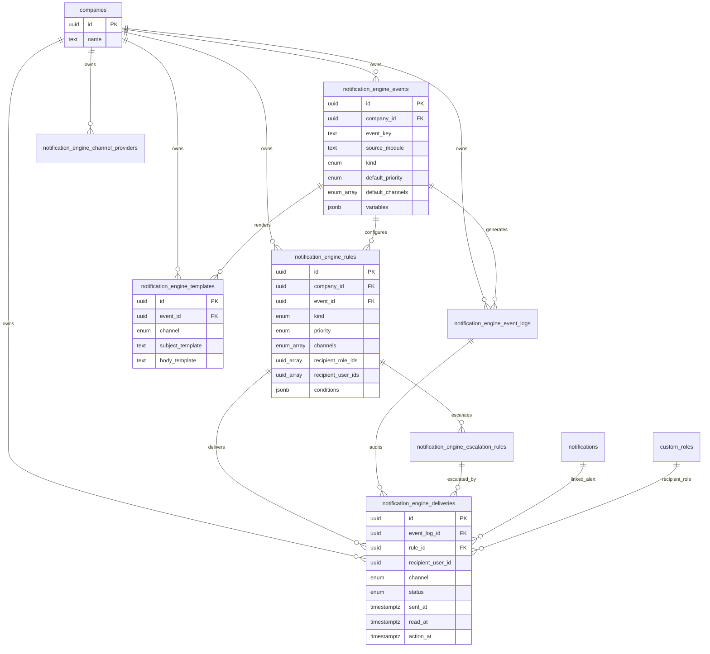

# Motor de Notificaciones y Alertas

## Objetivo

Modulo empresarial multiempresa para administrar eventos, reglas, destinatarios, canales, prioridades, plantillas, escalamiento, auditoria, historial y metricas sin cambios de codigo cuando se incorporen nuevos procesos.

El modulo convive con las notificaciones existentes de Empatiq y extiende el centro actual con una consola empresarial en `Centro de Notificaciones > Motor Empresarial`.

## Modelo de Datos

| Tabla | Proposito |
| --- | --- |
| `notification_engine_events` | Catalogo central de eventos por empresa. Cada registro tiene `company_id`, `event_key`, modulo origen, tipo, prioridad por defecto, canales por defecto, variables y payload de ejemplo. |
| `notification_engine_rules` | Reglas activas/inactivas por evento. Define tipo final, prioridad, canales, destinatarios por roles y usuarios, y condiciones JSON. |
| `notification_engine_templates` | Plantillas por evento y canal. Soporta asunto, cuerpo, variables dinamicas, plantilla por defecto y estado. |
| `notification_engine_channel_providers` | Proveedores extensibles por canal y empresa. Soporta `in_app`, `push`, `email`, `whatsapp`, `sms`, `teams`, `telegram` y `webhook`. |
| `notification_engine_escalation_rules` | Escalamiento automatico por regla: espera, secuencia, prioridad opcional, destinatarios adicionales, canales y reenvios. |
| `notification_engine_event_logs` | Bitacora de eventos generados por modulos. Registra evento, entidad, payload, prioridad, estado y fecha de generacion. |
| `notification_engine_deliveries` | Historial auditable por destinatario/canal: estado, envio, lectura, accion, error, reintentos y relacion con alerta en app. |
| `notifications` | Se extiende con `event_key`, `priority`, `is_attended`, `attended_at`, `attended_by` y `attention_note`. |

## Diagrama Entidad-Relacion

## Eventos Iniciales

El seed crea catalogo local por empresa para:

- `ContratoCreado`
- `ContratoPorVencer`
- `RequisicionCreada`
- `RequisicionPendienteAprobacion`
- `VacacionesAprobadas`
- `IncapacidadRegistrada`
- `CesantiasLiquidadas`
- `ExamenMedicoPorVencer`
- `DocumentoEmpleadoPorVencer`
- `DotacionPorVencer`

Estos eventos cubren las alertas/notificaciones que la app ya genera por contratos, requisiciones, vacaciones, incapacidades, cesantias, examenes, documentos y dotacion.

## Casos de Uso

1. Administrador crea evento
   - Entra al Motor Empresarial.
   - Registra `event_key`, modulo, tipo, prioridad, canales y variables.
   - El evento queda aislado por `company_id`.

2. Administrador configura regla
   - Selecciona evento.
   - Define si sera notificacion o alerta.
   - Asigna roles, usuarios o ambos.
   - Selecciona canales y prioridad.

3. Modulo registra evento
   - Inserta en `notification_engine_event_logs`.
   - El payload lleva variables como `{Empleado}`, `{Empresa}`, `{Fecha}`, `{Cargo}`, `{DiasRestantes}`.
   - Un worker/Edge Function procesa reglas activas y genera entregas.

4. Alerta requiere atencion
   - Se crea entrega y alerta en `notifications`.
   - El usuario lee la alerta.
   - RRHH o destinatario la marca como atendida.
   - La accion queda en `notifications` y puede relacionarse con `notification_engine_deliveries`.

5. Escalamiento automatico
   - Si una entrega sigue pendiente despues de `wait_minutes`, el procesador crea un nuevo envio segun la secuencia.
   - Ejemplo: 24h supervisor, 48h gerente, 72h director.

## APIs REST Supabase

Todas las APIs usan RLS, `company_id` y permisos del modulo.

| Accion | Metodo | Endpoint |
| --- | --- | --- |
| Listar eventos | `GET` | `/rest/v1/notification_engine_events?company_id=eq.{companyId}` |
| Crear evento | `POST` | `/rest/v1/notification_engine_events` |
| Actualizar evento | `PATCH` | `/rest/v1/notification_engine_events?id=eq.{id}` |
| Eliminar evento | `DELETE` | `/rest/v1/notification_engine_events?id=eq.{id}` |
| Listar reglas | `GET` | `/rest/v1/notification_engine_rules?company_id=eq.{companyId}` |
| Crear/editar reglas | `POST/PATCH` | `/rest/v1/notification_engine_rules` |
| Listar plantillas | `GET` | `/rest/v1/notification_engine_templates?company_id=eq.{companyId}` |
| Crear/editar plantillas | `POST/PATCH` | `/rest/v1/notification_engine_templates` |
| Listar proveedores | `GET` | `/rest/v1/notification_engine_channel_providers?company_id=eq.{companyId}` |
| Crear/editar proveedores | `POST/PATCH` | `/rest/v1/notification_engine_channel_providers` |
| Listar escalamiento | `GET` | `/rest/v1/notification_engine_escalation_rules?company_id=eq.{companyId}` |
| Registrar evento | `POST` | `/rest/v1/notification_engine_event_logs` |
| Consultar entregas | `GET` | `/rest/v1/notification_engine_deliveries?company_id=eq.{companyId}` |
| Marcar alerta atendida | `PATCH` | `/rest/v1/notifications?id=eq.{id}` |

## Permisos

Nuevo modulo RBAC:

- Codigo: `motor_notificaciones`
- Nombre: `Motor de Notificaciones y Alertas`
- Acciones: `view`, `create`, `update`, `delete`, `export`

Reglas de acceso:

- `view`: ver catalogo, reglas, plantillas, canales, escalamiento e historial.
- `create`: crear eventos, reglas, plantillas, proveedores, escalamiento y registros de eventos.
- `update`: editar configuracion y estados operativos.
- `delete`: eliminar configuraciones.
- `export`: reservado para metricas/reportes.

Las politicas RLS exigen `company_id`, membresia de empresa y permisos existentes. Los roles de sistema reciben el nuevo modulo automaticamente por migracion.

## Interfaces Administrativas

La pantalla `Centro de Notificaciones` conserva:

- Alertas en app.
- Historial de correos y envios.
- Reglas inteligentes existentes por rol.

Nueva pantalla embebida:

- `Eventos`: alta/edicion/eliminacion y registro de prueba.
- `Reglas`: destinatarios por rol/usuario, prioridad, canales y condiciones.
- `Plantillas`: asunto, cuerpo y variables dinamicas.
- `Escalamiento`: espera, secuencia, destinatarios adicionales, prioridad y reenvios.
- `Canales`: proveedores configurables por canal.
- `Metricas`: enviadas, leidas, pendientes, fallidas, atendidas, tiempo de respuesta y efectividad por canal.

## Estrategia de Escalabilidad

- Procesamiento asincrono: usar Edge Function o job programado que lea `notification_engine_event_logs` en estado `queued`.
- Idempotencia: usar `event_log_id + rule_id + recipient + channel` para evitar duplicados cuando se procese el mismo evento.
- Reintentos: controlar con `retry_policy`, `retry_count`, `status` y `error_message`.
- Canales externos: implementar adaptadores por `provider_key` sin cambiar tablas.
- Escalamiento: un job periodico evalua entregas pendientes y crea entregas nuevas por `notification_engine_escalation_rules`.
- Observabilidad: dashboards sobre `notification_engine_deliveries` y `notification_engine_event_logs`.
- Particionado futuro: si el volumen crece, particionar `notification_engine_deliveries` y `notification_engine_event_logs` por mes o por empresa.
- Seguridad: mantener RLS en tablas publicas expuestas y no exponer secretos de proveedores en cliente; credenciales reales deben vivir en Edge Functions o vault.
